GDG-SP
=====

This is the code for the GDG-SP check-in program using the apps.

This program generates a local database with information from the Meetup API. As a user scans the QR code generated by the apps on their webcam, the program detects the user and records their arrival time, thus maintaining a report of who attended the event. There is an option to send the list of absentees to the server and to count those who confirm but do not attend events.

It also prints labels using the Dymo Label SDK, which can contain the name, code, and arrival time of the person as soon as they scan the QR code on the webcam.

The main functions do not depend on an internet connection, provided the database has already been downloaded and users have already logged into the application.

## Screenshots

| Image 1 | Image 2 | Image 3 |
|-|-|-|
| 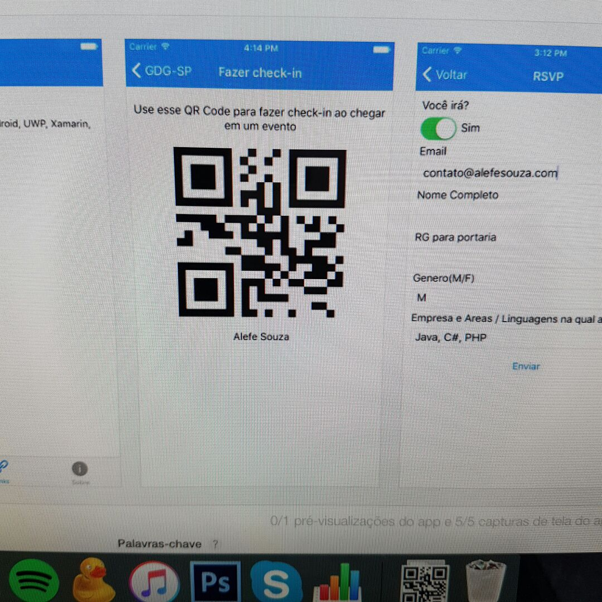 | 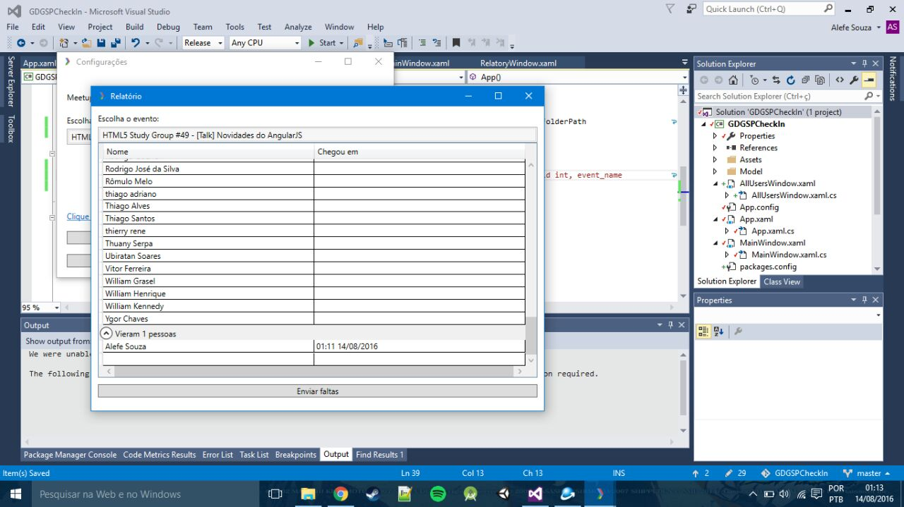 | 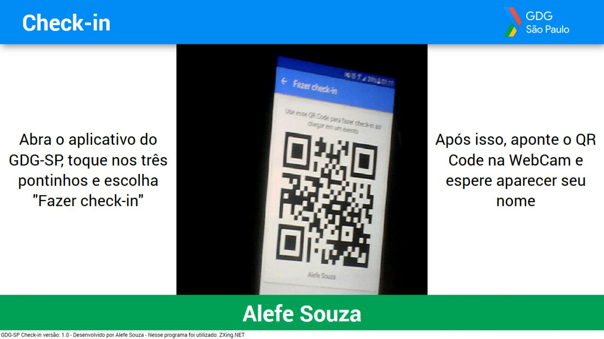 |
| 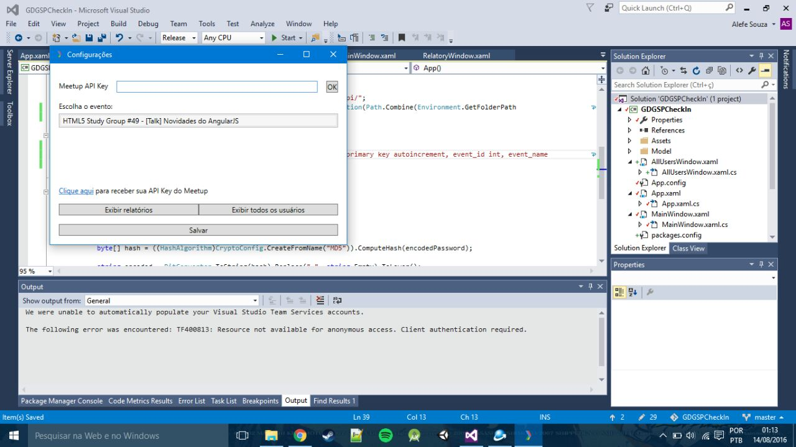 | 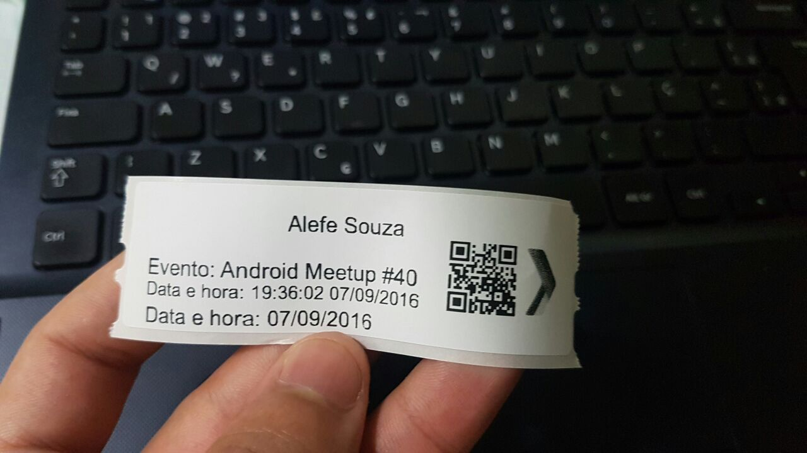 | 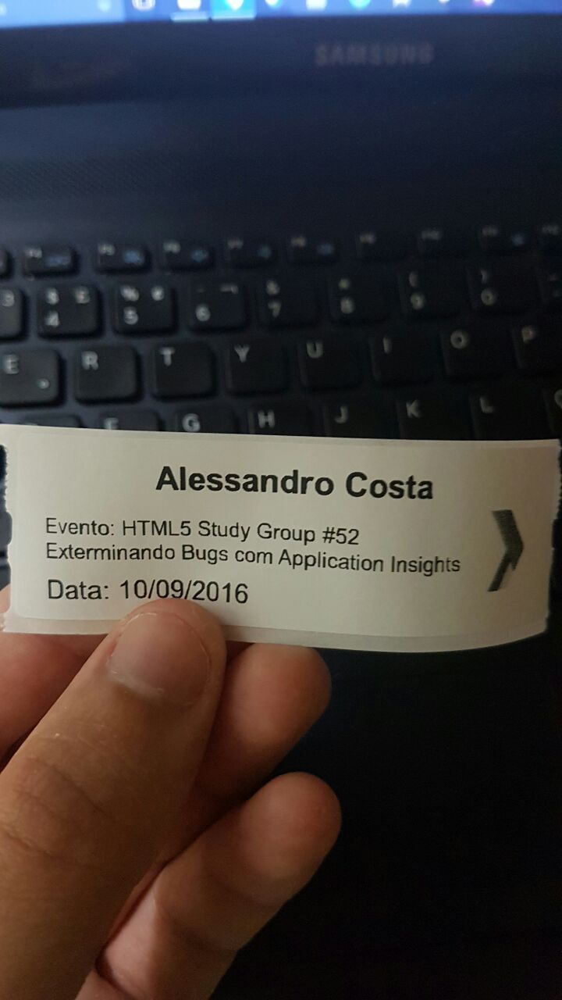 |
| 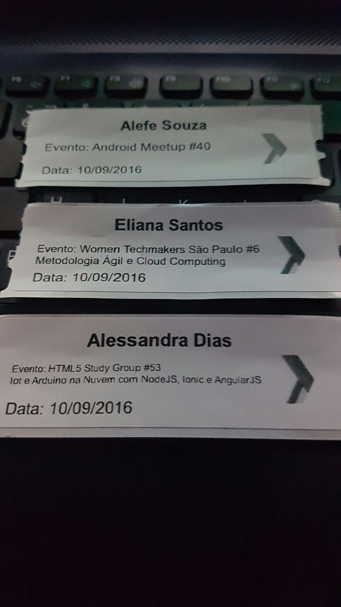 | 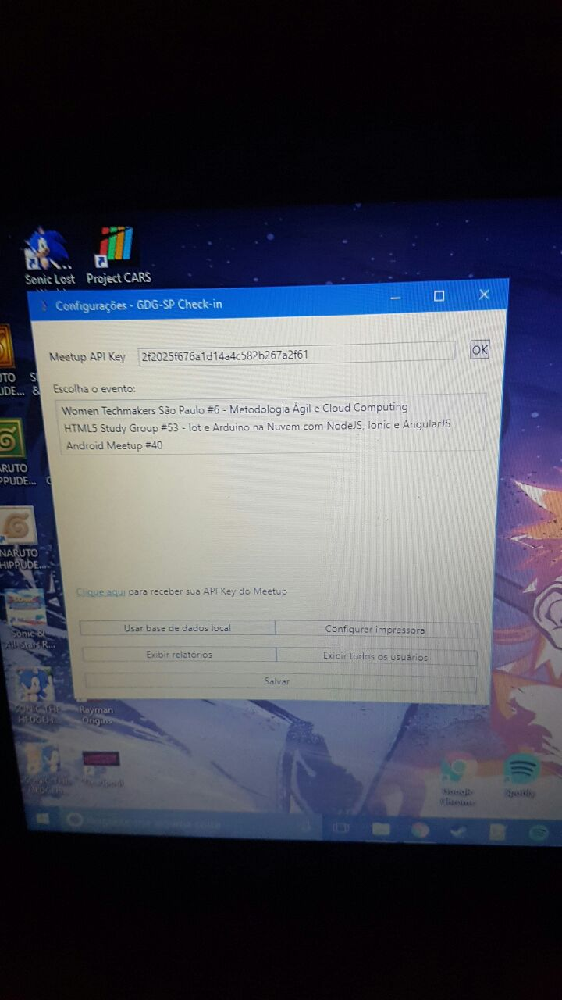 | 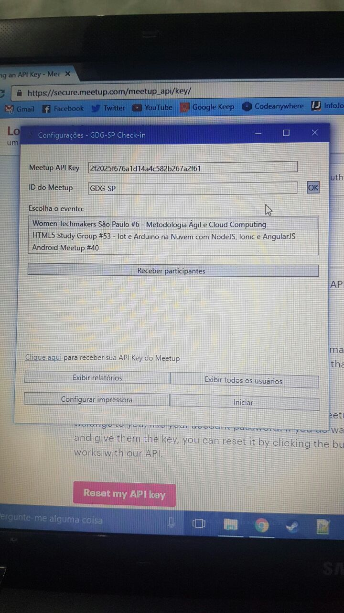 |
| 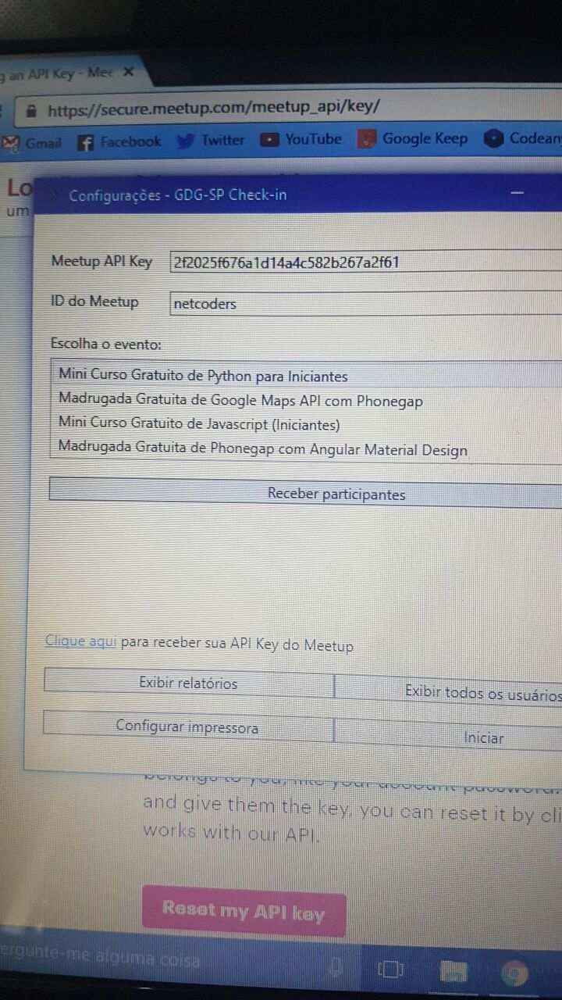 | 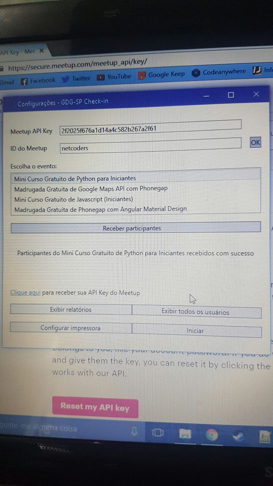 | 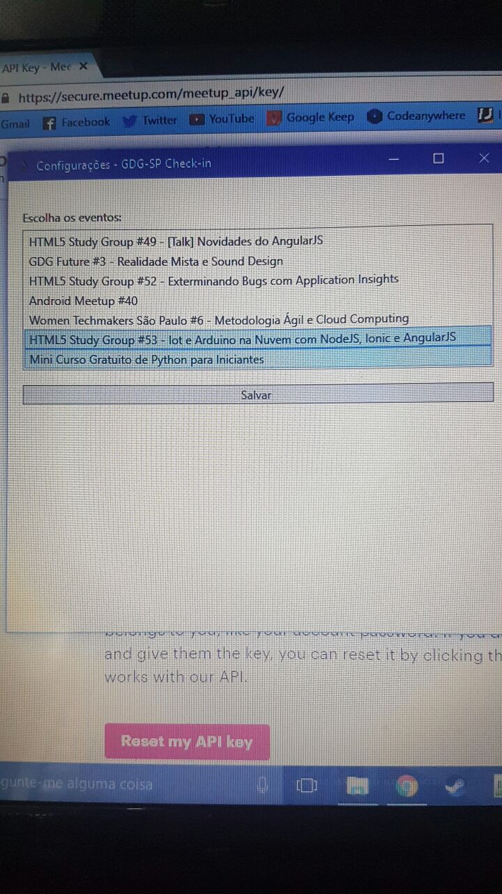 |
| 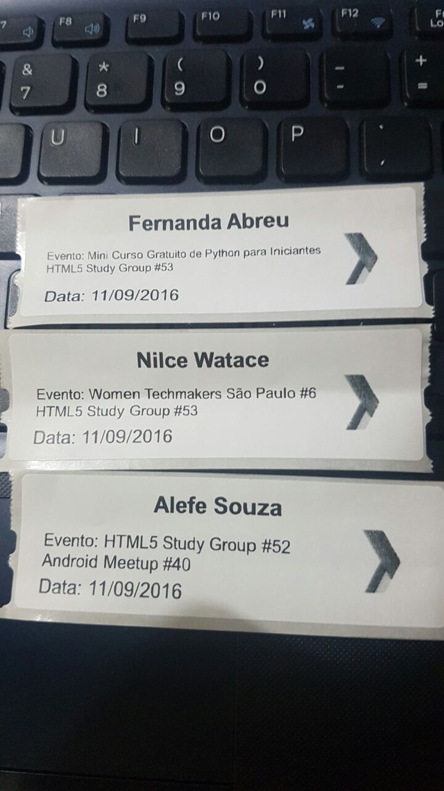 | 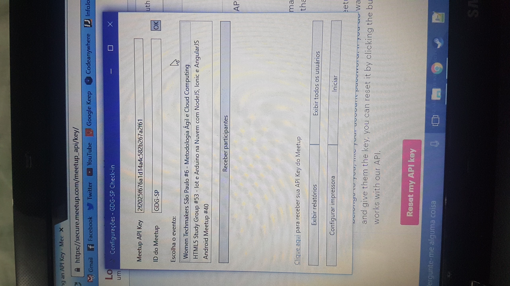 | 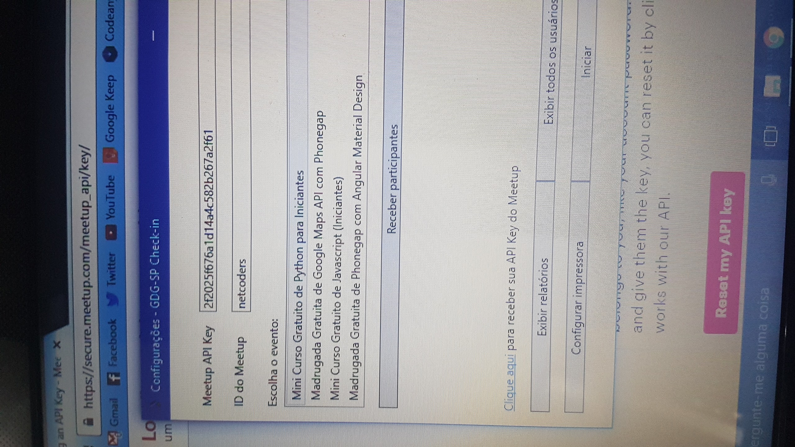 |

Requirements for execution: .NET Framework 4.5

If you want to adapt it for another Meetup:

- Edit the GDGSPCheckin/App.cs file with your Meetup information.
- Change the main icon.
- Keep the credits in the footer of the GDGSPCheckin/MainPage.xaml file, something like "Based on GDG-SP Check-in developed by Alefe Souza".

You will also need a PHP and MySQL server to use the back-end (only to register and display people with absences), for more information and the back-end files, [click here](../Back-end).

See also the other GDG-SP check-in software, [self-checkin](https://github.com/gdg-sp/self-checkin) developed by [Luis Leão](https://github.com/luisleao).

##### Portuguese

Código do programa de check-in do GDG-SP utilizando os aplicativos.

Esse programa gera uma base de dados local com informações da API do Meetup, e conforme um usuário passa o QR Code gerado pelos apps na WebCam, o programa detecta o usuário e registra o horário que ele chegou, para assim manter um relatório de quem veio ao evento, há a opção de enviar quem faltou para o servidor e fazer uma contagem para detectar quem confirma mas não comparece nos eventos.

Ele também imprime etiquetas usando o SDK do Dymo Label, podendo conter o nome, código e momento em que a pessoa chegou assim que ela passar o QR Code na WebCam.

As funções principais não dependem de conexão de internet, desde que a base de dados já tenha sido baixada anteriormente e os usuários já tenham feito login no aplicativo.

Requisitos para execução: .NET Framework 4.5

Caso você queira adaptá-lo para outro Meetup:

- Edite o arquivo GDGSPCheckin/App.cs com as informações do seu Meetup.
- Mude o ícone principal.
- Mantenha os créditos no rodapé do arquivo GDGSPCheckin/MainPage.xaml, algo como "Baseado no GDG-SP Check-in desenvolvido por Alefe Souza".

Você também precisará de um servidor PHP e MySQL para usar o back-end (apenas para registrar e exibir pessoas com faltas), para mais informações e os arquivos do back-end, [clique aqui](../Back-end).

Veja também o outro software de check-in do GDG-SP, o [self-checkin](https://github.com/gdg-sp/self-checkin) desenvolvido por [Luis Leão](https://github.com/luisleao).
