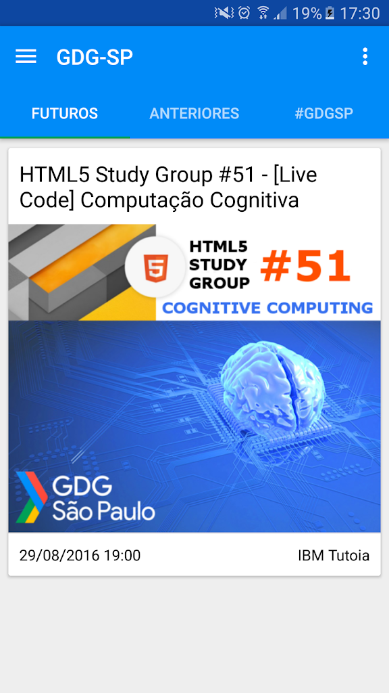
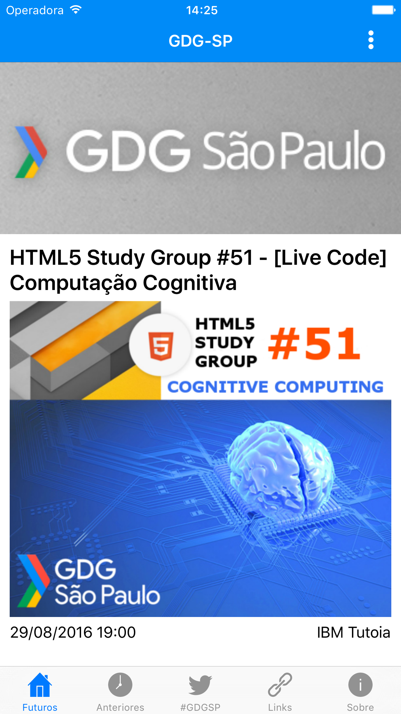
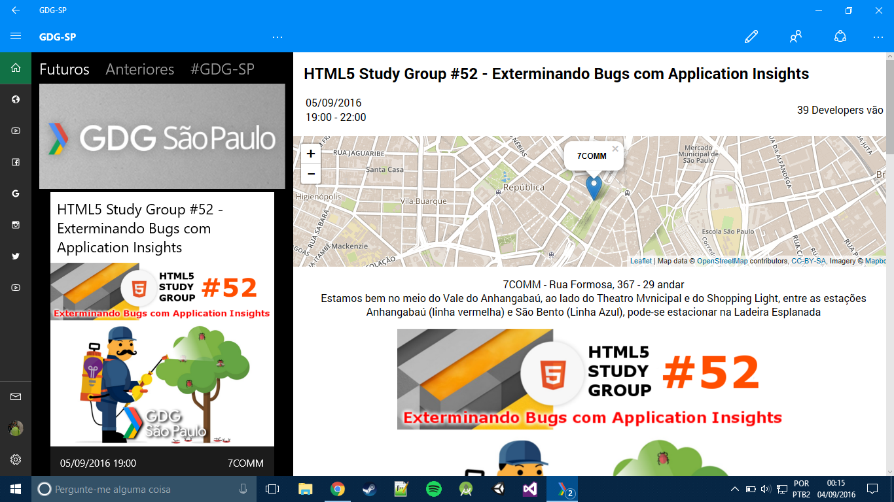
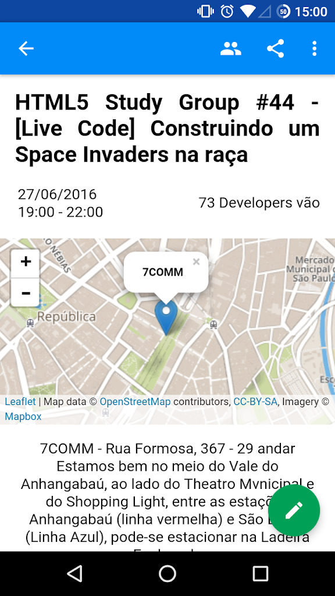
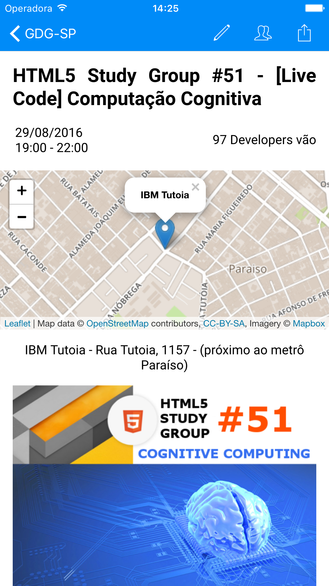
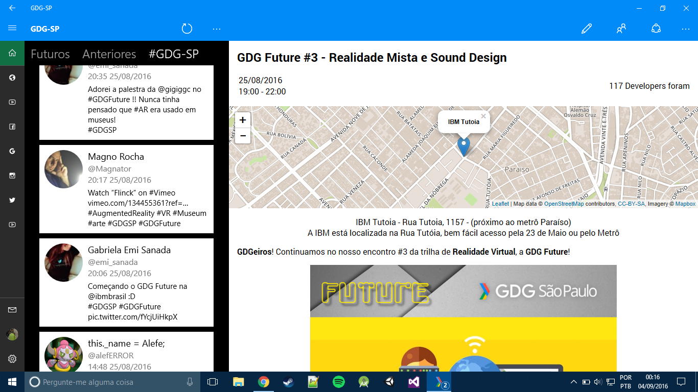
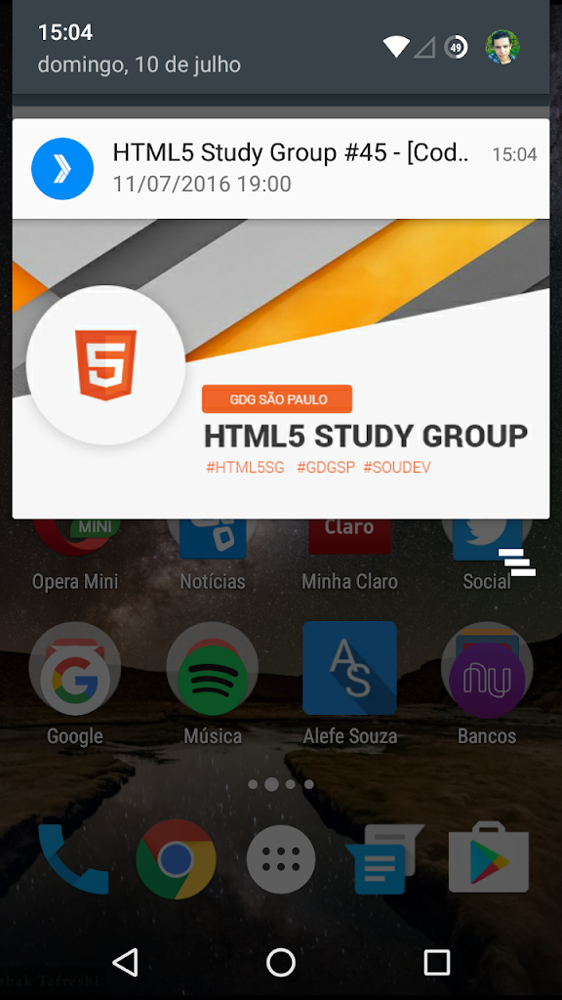
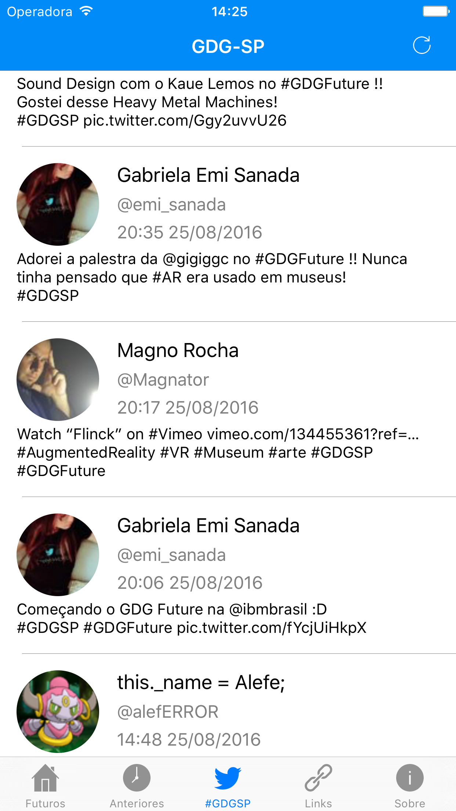

GDG-SP
=====

##### English

The Google Developers Group is an initiative of people interested in building with technology and disseminating knowledge. Our events are geared towards the community of developers, engineers, designers, and entrepreneurs, organized by our members on a voluntary and non-profit basis.

What's in this repository?
-----

This repository contains versions of the GDG-SP application that I developed for Android (native Java), Universal Windows Platform (native C#), and in Xamarin.Forms for iOS, Windows Phone, and Windows 8.1. It also includes the back-end code I developed in PHP, and the check-in program code, developed in C# for .NET Framework 4.5.

You can download it from:

[Play Store](https://play.google.com/store/apps/details?id=org.gdgsp)

[App Store](https://itunes.apple.com/app/gdg-sp/id1135565491)

[Windows Store](https://www.microsoft.com/store/apps/gdg-sp/9nblggh4xcj7)

To develop the applications I used the IDEs:

[Android Studio](https://developer.android.com/studio/index.html) and [AIDE](https://play.google.com/store/apps/details?id=com.aide.ui) for the Android application.

[Visual Studio Community 2015](https://www.visualstudio.com/pt-br/products/visual-studio-community-vs.aspx) in the UWP and Xamarin application, I had problems generating the iOS .ipa in Visual Studio, so I used [Xamarin Studio](https://www.xamarin.com/studio) on Mac just for that.

[Visual Studio Code](https://code.visualstudio.com/) and [Codeanywhere](https://codeanywhere.com) in the back-end development.

Screenshots
-----

The screenshots are from the Google Play, App Store, and Windows Store listings published in 2015.

| Android | iOS | UWP |
|-|-|-|
|  |  |  |
|  |  |  |
|  |  |  |

More screenshots, including the tablet version, [at this link](./Screenshots/).

Features
-----

With the app, you can:

- View upcoming and past events and what people are saying on Twitter about GDG-SP.
- See who responded to the events.
- RSVP and check in with your meetup account.
- Hold raffles.
- Easily access GDG-SP links.
- Receive notifications of new events.
- If you are an organizer or a selected user, you can send notifications to everyone or to those attending an event.

I tried to keep it very simple to adapt the app for other meetups. Each project has a README containing information on how to do this. If you need help adapting it for another meetup, you can contact me [by clicking here](mailto:contato@alefesouza.com).

##### Portuguese

O Google Developers Group é uma iniciativa de pessoas interessadas em construir com tecnologia e disseminar o conhecimento. Nossos eventos são direcionados para a comunidade de desenvolvedores, engenheiros, designers e empreendedores, organizados pelos nossos membros de forma voluntária e sem fins lucrativos.

O que há nesse repositório
-----

Nesse repositório há versões do aplicativo do GDG-SP que desenvolvi para Android (Java nativo), Universal Windows Platform (C# nativo) e em Xamarin.Forms para iOS, Windows Phone e Windows 8.1, também há o código que desenvolvi para o back-end, em PHP, e o código do programa de check-in, desenvolvido em C# para .NET Framework 4.5.

Você pode baixar na:

[Play Store](https://play.google.com/store/apps/details?id=org.gdgsp)

[App Store](https://itunes.apple.com/app/gdg-sp/id1135565491)

[Windows Store](https://www.microsoft.com/store/apps/gdg-sp/9nblggh4xcj7)

Para desenvolver os aplicativos eu utilizei as IDEs:

[Android Studio](https://developer.android.com/studio/index.html) e [AIDE](https://play.google.com/store/apps/details?id=com.aide.ui) no aplicativo para Android.

[Visual Studio Community 2015](https://www.visualstudio.com/pt-br/products/visual-studio-community-vs.aspx) no aplicativo para UWP e Xamarin, tive problemas para gerar o .ipa do iOS no Visual Studio, por isso usei o [Xamarin Studio](https://www.xamarin.com/studio) no Mac só para isso.

[Visual Studio Code](https://code.visualstudio.com/) e [Codeanywhere](https://codeanywhere.com) no desenvolvimento do back-end.

Recursos
-----

Com o aplicativo, você pode:

- Ver os eventos futuros e anteriores e o que estão falando no Twitter sobre o GDG-SP.
- Quem deu resposta aos eventos.
- Fazer RSVP e check-in com sua conta do meetup.
- Realizar sorteios.
- Ter acesso fácil aos links do GDG-SP.
- Receber notificações de novos eventos.
- Caso você seja organizador ou um usuário selecionado, você pode enviar notificações para todos ou para quem irá a um evento.

Procurei deixar muito simples para adaptar o aplicativo para outros meetups, em cada projeto há um README contendo informações de como fazer isso, caso você precise de ajuda enquanto adapta ele para outro meetup, pode entrar em contato comigo [clicando aqui](mailto:contato@alefesouza.com).

Licença
-----

    Copyright (C) 2017 Alefe Souza <contact@alefesouza.com>

    Licensed under the Apache License, Version 2.0 (the "License");
    you may not use this file except in compliance with the License.
    You may obtain a copy of the License at

        http://www.apache.org/licenses/LICENSE-2.0

    Unless required by applicable law or agreed to in writing, software
    distributed under the License is distributed on an "AS IS" BASIS,
    WITHOUT WARRANTIES OR CONDITIONS OF ANY KIND, either express or implied.
    See the License for the specific language governing permissions and
    limitations under the License.
